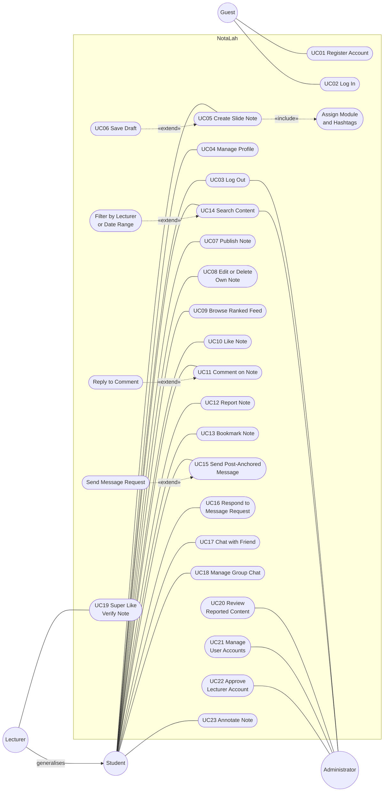

# Use case diagram

Mermaid has no use case type, so this is a flowchart: actors are circles, use cases are stadiums, dotted edges are
`<<include>>` / `<<extend>>`.

```mermaid
flowchart LR
  G((Guest))
  S((Student))
  L((Lecturer))
  A((Administrator))
  L -- generalises --> S

  subgraph SYS["NotaLah"]
    UC01([UC01 Register Account])
    UC02([UC02 Log In])
    UC03([UC03 Log Out])
    UC04([UC04 Manage Profile])
    UC14([UC14 Search Content])
    UC14x([Filter by Lecturer<br/>or Date Range])
    UC05([UC05 Create Slide Note])
    UC05i([Assign Module<br/>and Hashtags])
    UC06([UC06 Save Draft])
    UC07([UC07 Publish Note])
    UC08([UC08 Edit or Delete<br/>Own Note])
    UC09([UC09 Browse Ranked Feed])
    UC10([UC10 Like Note])
    UC11([UC11 Comment on Note])
    UC11x([Reply to Comment])
    UC12([UC12 Report Note])
    UC13([UC13 Bookmark Note])
    UC15([UC15 Send Post-Anchored<br/>Message])
    UC15x([Send Message Request])
    UC16([UC16 Respond to<br/>Message Request])
    UC17([UC17 Chat with Friend])
    UC18([UC18 Manage Group Chat])
    UC19([UC19 Super Like<br/>Verify Note])
    UC20([UC20 Review<br/>Reported Content])
    UC21([UC21 Manage<br/>User Accounts])
    UC22([UC22 Approve<br/>Lecturer Account])
    UC23([UC23 Annotate Note])
  end

  G --- UC01
  G --- UC02
  S --- UC03
  S --- UC04
  S --- UC05
  UC05 -. "«include»" .-> UC05i
  UC06 -. "«extend»" .-> UC05
  S --- UC07
  S --- UC08
  S --- UC09
  S --- UC10
  S --- UC11
  UC11x -. "«extend»" .-> UC11
  S --- UC12
  S --- UC13
  S --- UC23
  S --- UC14
  UC14x -. "«extend»" .-> UC14
  S --- UC15
  UC15x -. "«extend»" .-> UC15
  S --- UC16
  S --- UC17
  S --- UC18
  L --- UC19

  UC03 --- A
  UC14 --- A
  UC20 --- A
  UC21 --- A
  UC22 --- A
```
