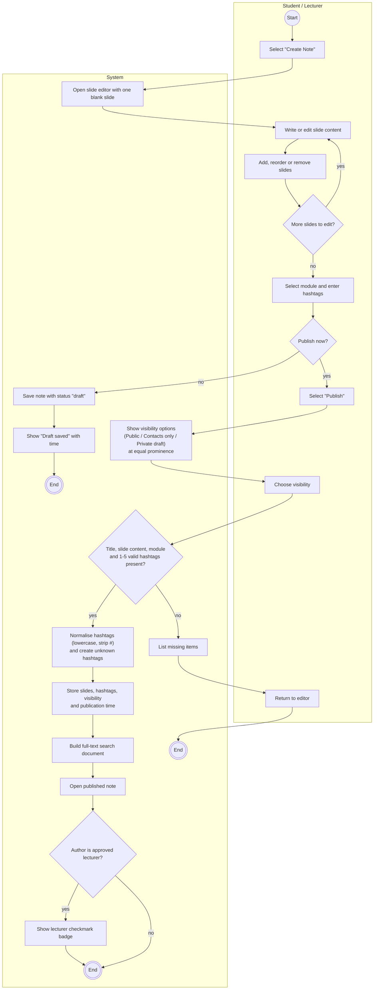

# Activity diagram: publish note

Mermaid has no activity type; swimlanes are subgraphs.

```mermaid
flowchart TB
  subgraph U["Student / Lecturer"]
    start((Start))
    a1["Select #quot;Create Note#quot;"]
    a3[Write or edit slide content]
    a4[Add, reorder or remove slides]
    d1{More slides to edit?}
    a5[Select module and enter hashtags]
    d2{Publish now?}
    a8["Select #quot;Publish#quot;"]
    a10[Choose visibility]
    a12[Return to editor]
  end
  subgraph SYS["System"]
    a2[Open slide editor with one blank slide]
    a6["Save note with status #quot;draft#quot;"]
    a7["Show #quot;Draft saved#quot; with time"]
    a9["Show visibility options<br/>(Public / Contacts only / Private draft)<br/>at equal prominence"]
    d3{"Title, slide content, module<br/>and 1-5 valid hashtags present?"}
    a11[List missing items]
    a13["Normalise hashtags (lowercase, strip #35;)<br/>and create unknown hashtags"]
    a14["Store slides, hashtags, visibility<br/>and publication time"]
    a15[Build full-text search document]
    a16[Open published note]
    d4{Author is approved lecturer?}
    a17[Show lecturer checkmark badge]
    e1(((End)))
    e2(((End)))
    e3(((End)))
  end

  start --> a1 --> a2 --> a3 --> a4 --> d1
  d1 -- yes --> a3
  d1 -- no --> a5 --> d2
  d2 -- no --> a6 --> a7 --> e1
  d2 -- yes --> a8 --> a9 --> a10 --> d3
  d3 -- no --> a11 --> a12 --> e2
  d3 -- yes --> a13 --> a14 --> a15 --> a16 --> d4
  d4 -- yes --> a17 --> e3
  d4 -- no --> e3
```
