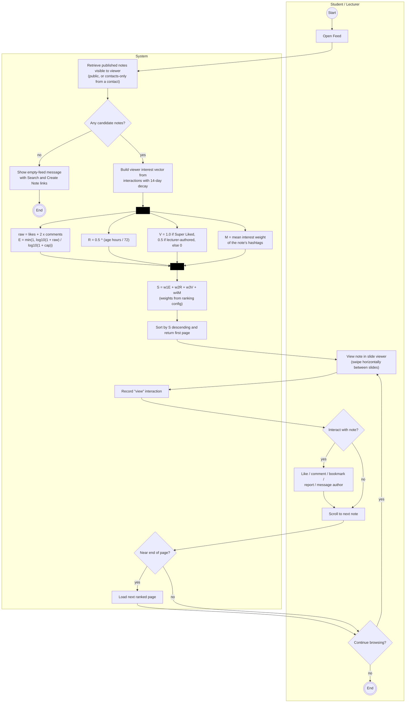

# Activity diagram: ranked feed

Mermaid has no activity type; swimlanes are subgraphs and the fork/join bars are thin nodes.

```mermaid
flowchart TB
  subgraph U["Student / Lecturer"]
    start((Start))
    a1[Open Feed]
    a9["View note in slide viewer<br/>(swipe horizontally between slides)"]
    d2{Interact with note?}
    a11["Like / comment / bookmark /<br/>report / message author"]
    a12[Scroll to next note]
    d4{Continue browsing?}
    e2(((End)))
  end
  subgraph SYS["System"]
    a2["Retrieve published notes visible to viewer<br/>(public, or contacts-only from a contact)"]
    d1{Any candidate notes?}
    a3[Show empty-feed message<br/>with Search and Create Note links]
    e1(((End)))
    a4[Build viewer interest vector from<br/>interactions with 14-day decay]
    fork[" "]
    e["raw = likes + 2 x comments<br/>E = min(1, log10(1 + raw) / log10(1 + cap))"]
    r["R = 0.5 ^ (age hours / 72)"]
    v["V = 1.0 if Super Liked,<br/>0.5 if lecturer-authored, else 0"]
    m["M = mean interest weight<br/>of the note's hashtags"]
    join[" "]
    a7["S = w1E + w2R + w3V + w4M<br/>(weights from ranking config)"]
    a8[Sort by S descending and return first page]
    a10["Record #quot;view#quot; interaction"]
    d3{Near end of page?}
    a13[Load next ranked page]
  end

  start --> a1 --> a2 --> d1
  d1 -- no --> a3 --> e1
  d1 -- yes --> a4 --> fork
  fork --> e & r & v & m
  e & r & v & m --> join
  join --> a7 --> a8 --> a9 --> a10 --> d2
  d2 -- yes --> a11 --> a12
  d2 -- no --> a12
  a12 --> d3
  d3 -- yes --> a13 --> d4
  d3 -- no --> d4
  d4 -- yes --> a9
  d4 -- no --> e2

  classDef bar fill:#000,stroke:#000,color:#000
  class fork,join bar
```
