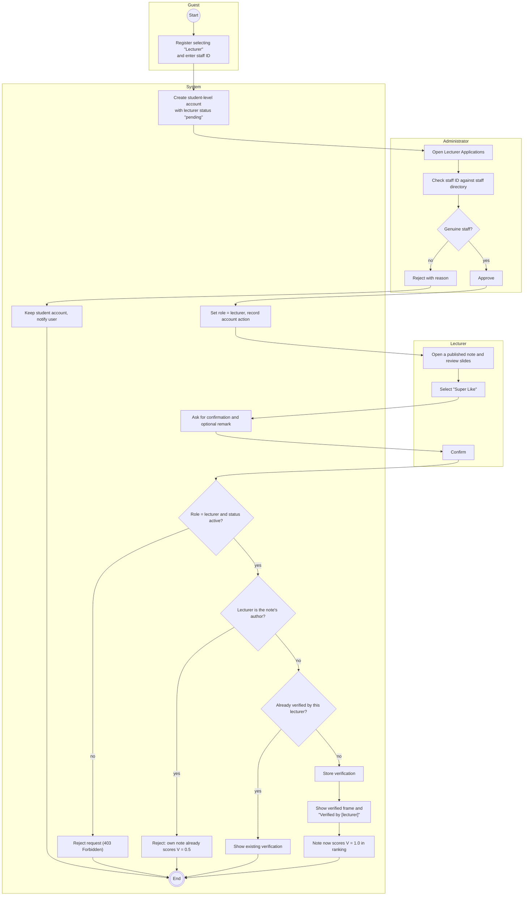

# Activity diagram: lecturer verification

Mermaid has no activity type; swimlanes are subgraphs.

```mermaid
flowchart TB
  subgraph G["Guest"]
    start((Start))
    a1["Register selecting #quot;Lecturer#quot;<br/>and enter staff ID"]
  end
  subgraph AD["Administrator"]
    a3[Open Lecturer Applications]
    a4[Check staff ID against staff directory]
    d1{Genuine staff?}
    a5[Reject with reason]
    a7[Approve]
  end
  subgraph L["Lecturer"]
    a9[Open a published note and review slides]
    a10["Select #quot;Super Like#quot;"]
    a12[Confirm]
  end
  subgraph SYS["System"]
    a2["Create student-level account<br/>with lecturer status #quot;pending#quot;"]
    a6[Keep student account, notify user]
    a8[Set role = lecturer, record account action]
    a11[Ask for confirmation and optional remark]
    d2{Role = lecturer and status active?}
    r1["Reject request (403 Forbidden)"]
    d3{Lecturer is the note's author?}
    r2["Reject: own note already scores V = 0.5"]
    d4{Already verified by this lecturer?}
    r3[Show existing verification]
    a13[Store verification]
    a14["Show verified frame and<br/>#quot;Verified by [lecturer]#quot;"]
    a15[Note now scores V = 1.0 in ranking]
    e(((End)))
  end

  start --> a1 --> a2 --> a3 --> a4 --> d1
  d1 -- no --> a5 --> a6 --> e
  d1 -- yes --> a7 --> a8 --> a9 --> a10 --> a11 --> a12 --> d2
  d2 -- no --> r1 --> e
  d2 -- yes --> d3
  d3 -- yes --> r2 --> e
  d3 -- no --> d4
  d4 -- yes --> r3 --> e
  d4 -- no --> a13 --> a14 --> a15 --> e
```
