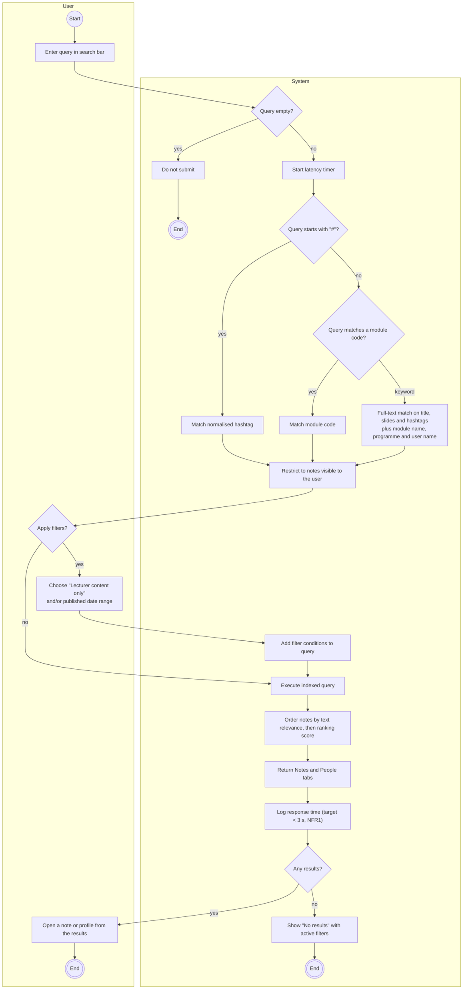

# Activity diagram: search

Mermaid has no activity type; swimlanes are subgraphs.

```mermaid
flowchart TB
  subgraph U["User"]
    start((Start))
    a1[Enter query in search bar]
    d3{Apply filters?}
    a6["Choose #quot;Lecturer content only#quot;<br/>and/or published date range"]
    a12[Open a note or profile from the results]
    e3(((End)))
  end
  subgraph SYS["System"]
    d1{Query empty?}
    a2[Do not submit]
    e1(((End)))
    a3[Start latency timer]
    d2{"Query starts with #quot;#35;#quot;?"}
    h[Match normalised hashtag]
    dm{Query matches a module code?}
    mc[Match module code]
    kw["Full-text match on title, slides and hashtags<br/>plus module name, programme and user name"]
    a4[Restrict to notes visible to the user]
    a7[Add filter conditions to query]
    a8[Execute indexed query]
    a9[Order notes by text relevance, then ranking score]
    a10[Return Notes and People tabs]
    a11["Log response time (target #lt; 3 s, NFR1)"]
    d4{Any results?}
    a13["Show #quot;No results#quot; with active filters"]
    e2(((End)))
  end

  start --> a1 --> d1
  d1 -- yes --> a2 --> e1
  d1 -- no --> a3 --> d2
  d2 -- yes --> h --> a4
  d2 -- no --> dm
  dm -- yes --> mc --> a4
  dm -- keyword --> kw --> a4
  a4 --> d3
  d3 -- yes --> a6 --> a7 --> a8
  d3 -- no --> a8
  a8 --> a9 --> a10 --> a11 --> d4
  d4 -- no --> a13 --> e2
  d4 -- yes --> a12 --> e3
```
