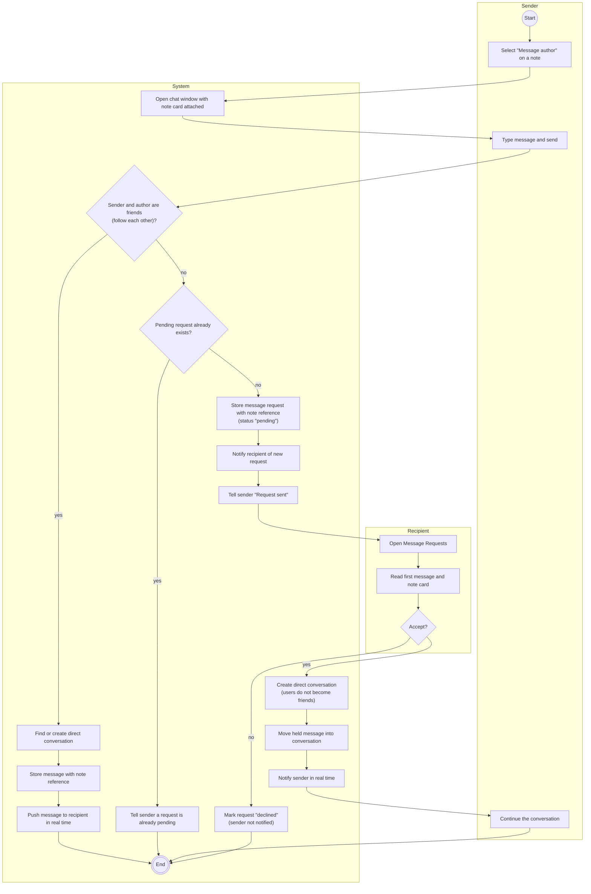

# Activity diagram: post-anchored message

Mermaid has no activity type; swimlanes are subgraphs.

```mermaid
flowchart TB
  subgraph S["Sender"]
    start((Start))
    a1["Select #quot;Message author#quot; on a note"]
    a3[Type message and send]
    a14[Continue the conversation]
  end
  subgraph SYS["System"]
    a2[Open chat window with note card attached]
    d1{"Sender and author are friends<br/>(follow each other)?"}
    a4[Find or create direct conversation]
    a5[Store message with note reference]
    a6[Push message to recipient in real time]
    d2{Pending request already exists?}
    a7[Tell sender a request is already pending]
    a8["Store message request with note reference<br/>(status #quot;pending#quot;)"]
    a9[Notify recipient of new request]
    a10["Tell sender #quot;Request sent#quot;"]
    a11["Create direct conversation<br/>(users do not become friends)"]
    a12[Move held message into conversation]
    a13[Notify sender in real time]
    a15["Mark request #quot;declined#quot;<br/>(sender not notified)"]
    e(((End)))
  end
  subgraph R["Recipient"]
    r1[Open Message Requests]
    r2[Read first message and note card]
    d3{Accept?}
  end

  start --> a1 --> a2 --> a3 --> d1
  d1 -- yes --> a4 --> a5 --> a6 --> e
  d1 -- no --> d2
  d2 -- yes --> a7 --> e
  d2 -- no --> a8 --> a9 --> a10 --> r1 --> r2 --> d3
  d3 -- yes --> a11 --> a12 --> a13 --> a14 --> e
  d3 -- no --> a15 --> e
```
