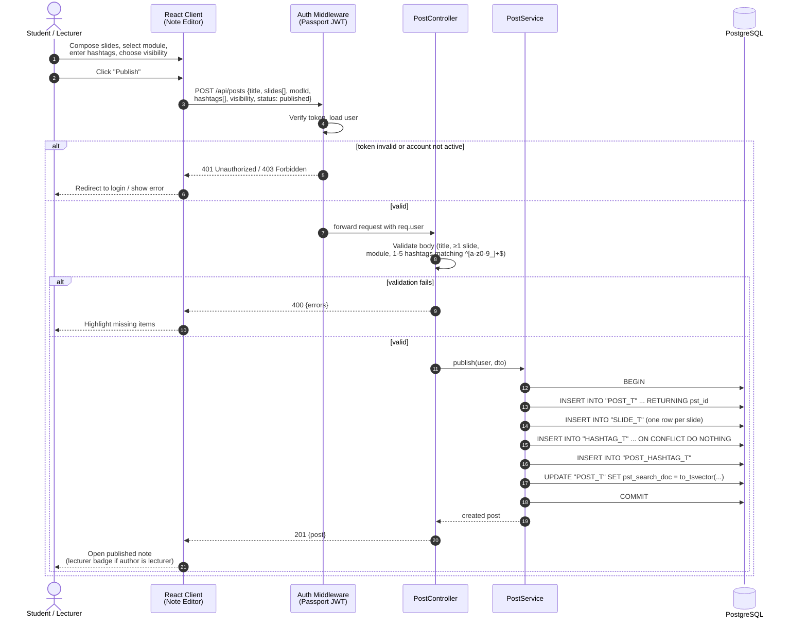

# Sequence diagram: publish note

```mermaid
sequenceDiagram
  autonumber
  actor U as Student / Lecturer
  participant C as React Client<br/>(Note Editor)
  participant A as Auth Middleware<br/>(Passport JWT)
  participant PC as PostController
  participant PS as PostService
  participant DB@{ "type": "database" } as PostgreSQL

  U->>C: Compose slides, select module,<br/>enter hashtags, choose visibility
  U->>C: Click "Publish"
  C->>A: POST /api/posts {title, slides[], modId,<br/>hashtags[], visibility, status: published}
  A->>A: Verify token, load user
  alt token invalid or account not active
    A-->>C: 401 Unauthorized / 403 Forbidden
    C-->>U: Redirect to login / show error
  else valid
    A->>PC: forward request with req.user
    PC->>PC: Validate body (title, ≥1 slide,<br/>module, 1-5 hashtags matching ^[a-z0-9_]+$)
    alt validation fails
      PC-->>C: 400 {errors}
      C-->>U: Highlight missing items
    else valid
      PC->>PS: publish(user, dto)
      PS->>DB: BEGIN
      PS->>DB: INSERT INTO "POST_T" ... RETURNING pst_id
      PS->>DB: INSERT INTO "SLIDE_T" (one row per slide)
      PS->>DB: INSERT INTO "HASHTAG_T" ... ON CONFLICT DO NOTHING
      PS->>DB: INSERT INTO "POST_HASHTAG_T"
      PS->>DB: UPDATE "POST_T" SET pst_search_doc = to_tsvector(...)
      PS->>DB: COMMIT
      PS-->>PC: created post
      PC-->>C: 201 {post}
      C-->>U: Open published note<br/>(lecturer badge if author is lecturer)
    end
  end
```
