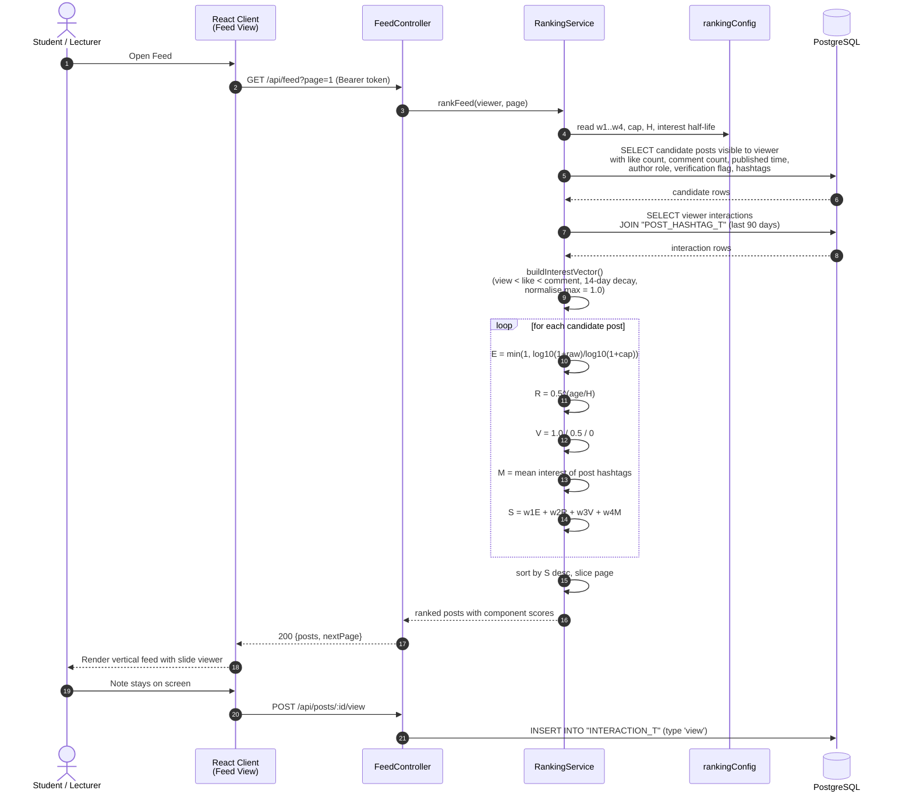

# Sequence diagram: ranked feed

```mermaid
sequenceDiagram
  autonumber
  actor U as Student / Lecturer
  participant C as React Client<br/>(Feed View)
  participant FC as FeedController
  participant RS as RankingService
  participant CFG as rankingConfig
  participant DB@{ "type": "database" } as PostgreSQL

  U->>C: Open Feed
  C->>FC: GET /api/feed?page=1 (Bearer token)
  FC->>RS: rankFeed(viewer, page)
  RS->>CFG: read w1..w4, cap, H, interest half-life
  RS->>DB: SELECT candidate posts visible to viewer<br/>with like count, comment count, published time,<br/>author role, verification flag, hashtags
  DB-->>RS: candidate rows
  RS->>DB: SELECT viewer interactions<br/>JOIN "POST_HASHTAG_T" (last 90 days)
  DB-->>RS: interaction rows
  RS->>RS: buildInterestVector()<br/>(view < like < comment, 14-day decay,<br/>normalise max = 1.0)
  loop for each candidate post
    RS->>RS: E = min(1, log10(1+raw)/log10(1+cap))
    RS->>RS: R = 0.5^(age/H)
    RS->>RS: V = 1.0 / 0.5 / 0
    RS->>RS: M = mean interest of post hashtags
    RS->>RS: S = w1E + w2R + w3V + w4M
  end
  RS->>RS: sort by S desc, slice page
  RS-->>FC: ranked posts with component scores
  FC-->>C: 200 {posts, nextPage}
  C-->>U: Render vertical feed with slide viewer
  U->>C: Note stays on screen
  C->>FC: POST /api/posts/:id/view
  FC->>DB: INSERT INTO "INTERACTION_T" (type 'view')
```
