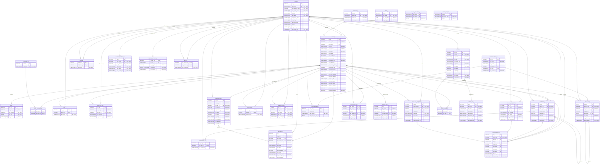

# Entity relationship diagram

`NOT NULL` comments mark the mandatory (`*`) columns of the PlantUML original.

```mermaid
erDiagram
  USER_T {
    INTEGER usr_id PK
    VARCHAR(255) usr_email UK "NOT NULL"
    CHAR(60) usr_password_hash "NOT NULL"
    VARCHAR(50) usr_display_name "NOT NULL"
    VARCHAR(10) usr_role "NOT NULL"
    VARCHAR(10) usr_status "NOT NULL"
    VARCHAR(10) usr_lecturer_status
    VARCHAR(20) usr_staff_id
    VARCHAR(100) usr_programme
    VARCHAR(300) usr_bio
    VARCHAR(255) usr_avatar_url
    TIMESTAMPTZ usr_created_at "NOT NULL"
  }
  MODULE_T {
    INTEGER mod_id PK
    VARCHAR(20) mod_code UK "NOT NULL"
    VARCHAR(150) mod_name "NOT NULL"
    VARCHAR(100) mod_programme "NOT NULL"
  }
  POST_T {
    INTEGER pst_id PK
    INTEGER pst_usr_id FK "NOT NULL"
    INTEGER pst_mod_id FK
    VARCHAR(150) pst_title "NOT NULL"
    VARCHAR(30) pst_template "NOT NULL"
    VARCHAR(10) pst_status "NOT NULL"
    VARCHAR(10) pst_visibility
    TSVECTOR pst_search_doc
    TIMESTAMPTZ pst_created_at "NOT NULL"
    TIMESTAMPTZ pst_updated_at "NOT NULL"
    TIMESTAMPTZ pst_published_at
    TIMESTAMPTZ pst_content_edited_at
    INTEGER pst_lock_usr_id FK
    TIMESTAMPTZ pst_lock_expires_at
    VARCHAR(4) pst_aspect "NOT NULL"
    VARCHAR(10) pst_music_provider
    BIGINT pst_music_track_id
    VARCHAR(200) pst_music_title
    VARCHAR(200) pst_music_artist
    VARCHAR(500) pst_music_cover
    VARCHAR(200) pst_music_license
    SMALLINT pst_music_volume
    BOOLEAN pst_annotations_on "NOT NULL"
  }
  SLIDE_T {
    INTEGER sld_id PK
    INTEGER sld_pst_id FK "NOT NULL"
    SMALLINT sld_position "NOT NULL"
    JSONB sld_doc "NOT NULL"
    VARCHAR(2000) sld_notes "NOT NULL"
  }
  HASHTAG_T {
    INTEGER hsh_id PK
    VARCHAR(50) hsh_name UK "NOT NULL"
  }
  POST_HASHTAG_T {
    INTEGER phs_pst_id PK, FK
    INTEGER phs_hsh_id PK, FK
  }
  LIKE_T {
    INTEGER lik_usr_id PK, FK
    INTEGER lik_pst_id PK, FK
    TIMESTAMPTZ lik_created_at "NOT NULL"
  }
  VERIFICATION_T {
    INTEGER ver_id PK
    INTEGER ver_pst_id FK "NOT NULL"
    INTEGER ver_usr_id FK "NOT NULL"
    VARCHAR(300) ver_remark
    TIMESTAMPTZ ver_created_at "NOT NULL"
  }
  COMMENT_T {
    INTEGER cmt_id PK
    INTEGER cmt_pst_id FK "NOT NULL"
    INTEGER cmt_usr_id FK "NOT NULL"
    INTEGER cmt_parent_id FK
    SMALLINT cmt_slide_no
    VARCHAR(1000) cmt_body "NOT NULL"
    BOOLEAN cmt_is_deleted "NOT NULL"
    TIMESTAMPTZ cmt_created_at "NOT NULL"
  }
  COMMENT_LIKE_T {
    INTEGER clk_usr_id PK, FK
    INTEGER clk_cmt_id PK, FK
    TIMESTAMPTZ clk_created_at "NOT NULL"
  }
  REPORT_T {
    INTEGER rpt_id PK
    INTEGER rpt_pst_id FK "NOT NULL"
    INTEGER rpt_ant_id FK
    INTEGER rpt_reporter_id FK "NOT NULL"
    VARCHAR(30) rpt_reason "NOT NULL"
    VARCHAR(500) rpt_details
    VARCHAR(10) rpt_status "NOT NULL"
    INTEGER rpt_resolved_by FK
    VARCHAR(300) rpt_remark
    TIMESTAMPTZ rpt_created_at "NOT NULL"
    TIMESTAMPTZ rpt_resolved_at
  }
  ANNOTATION_T {
    INTEGER ant_id PK
    INTEGER ant_pst_id FK "NOT NULL"
    INTEGER ant_usr_id FK "NOT NULL"
    SMALLINT ant_slide_id "NOT NULL"
    VARCHAR(36) ant_element_id "NOT NULL"
    VARCHAR(300) ant_quote "NOT NULL"
    INTEGER ant_offset "NOT NULL"
    VARCHAR(500) ant_body "NOT NULL"
    TIMESTAMPTZ ant_created_at "NOT NULL"
    TIMESTAMPTZ ant_deleted_at
    TIMESTAMPTZ ant_hidden_at
  }
  BOOKMARK_T {
    INTEGER bmk_usr_id PK, FK
    INTEGER bmk_pst_id PK, FK
    TIMESTAMPTZ bmk_created_at "NOT NULL"
  }
  INTERACTION_T {
    BIGINT int_id PK
    INTEGER int_usr_id FK "NOT NULL"
    INTEGER int_pst_id FK "NOT NULL"
    VARCHAR(10) int_type "NOT NULL"
    TIMESTAMPTZ int_created_at "NOT NULL"
  }
  FOLLOW_T {
    INTEGER fol_follower_id PK, FK
    INTEGER fol_followee_id PK, FK
    TIMESTAMPTZ fol_created_at "NOT NULL"
  }
  MESSAGE_REQUEST_T {
    INTEGER mrq_id PK
    INTEGER mrq_sender_id FK "NOT NULL"
    INTEGER mrq_recipient_id FK "NOT NULL"
    INTEGER mrq_pst_id FK
    VARCHAR(2000) mrq_body "NOT NULL"
    VARCHAR(10) mrq_status "NOT NULL"
    TIMESTAMPTZ mrq_created_at "NOT NULL"
    TIMESTAMPTZ mrq_responded_at
  }
  CONVERSATION_T {
    INTEGER cnv_id PK
    VARCHAR(10) cnv_type "NOT NULL"
    VARCHAR(80) cnv_name
    INTEGER cnv_owner_id FK
    VARCHAR(21) cnv_pair UK
    TIMESTAMPTZ cnv_created_at "NOT NULL"
  }
  CONV_MEMBER_T {
    INTEGER cmb_cnv_id PK, FK
    INTEGER cmb_usr_id PK, FK
    TIMESTAMPTZ cmb_joined_at "NOT NULL"
    BIGINT cmb_last_read_msg_id
  }
  MESSAGE_T {
    BIGINT msg_id PK
    INTEGER msg_cnv_id FK "NOT NULL"
    INTEGER msg_sender_id FK "NOT NULL"
    INTEGER msg_pst_id FK
    BIGINT msg_reply_to_id FK
    VARCHAR(2000) msg_body "NOT NULL"
    TIMESTAMPTZ msg_deleted_at
    TIMESTAMPTZ msg_created_at "NOT NULL"
  }
  ACCOUNT_ACTION_T {
    INTEGER aac_id PK
    INTEGER aac_usr_id FK "NOT NULL"
    INTEGER aac_admin_id FK "NOT NULL"
    VARCHAR(20) aac_action "NOT NULL"
    VARCHAR(300) aac_reason "NOT NULL"
    TIMESTAMPTZ aac_created_at "NOT NULL"
  }
  FEED_SNAPSHOT_T {
    INTEGER fsn_usr_id PK, FK
    TIMESTAMPTZ fsn_as_of PK
    INTEGER[] fsn_pst_ids "NOT NULL"
    DOUBLE_PRECISION[] fsn_scores "NOT NULL"
    TIMESTAMPTZ fsn_created_at "NOT NULL"
  }
  COLLABORATOR_T {
    INTEGER clb_pst_id PK, FK
    INTEGER clb_usr_id PK, FK
    VARCHAR(4) clb_role "NOT NULL"
    INTEGER clb_added_by FK "NOT NULL"
    TIMESTAMPTZ clb_created_at "NOT NULL"
    TIMESTAMPTZ clb_edited_at
  }
  SHARE_LINK_T {
    INTEGER shl_id PK
    INTEGER shl_pst_id FK "NOT NULL"
    VARCHAR(4) shl_role "NOT NULL"
    CHAR(64) shl_token_hash UK "NOT NULL"
    TIMESTAMPTZ shl_created_at "NOT NULL"
    TIMESTAMPTZ shl_revoked_at
  }
  COLLAB_REQUEST_T {
    INTEGER crq_id PK
    INTEGER crq_pst_id FK "NOT NULL"
    INTEGER crq_usr_id FK "NOT NULL"
    VARCHAR(300) crq_message
    VARCHAR(8) crq_status "NOT NULL"
    TIMESTAMPTZ crq_created_at "NOT NULL"
    TIMESTAMPTZ crq_decided_at
  }
  TERM_T {
    INTEGER trm_id PK
    VARCHAR(50) trm_name UK "NOT NULL"
    DATE trm_start_date "NOT NULL"
    DATE trm_end_date "NOT NULL"
  }
  BLOCK_T {
    INTEGER blk_blocker_id PK, FK
    INTEGER blk_blocked_id PK, FK
    TIMESTAMPTZ blk_created_at "NOT NULL"
  }
  NOTIFICATION_T {
    INTEGER ntf_id PK
    INTEGER ntf_usr_id FK "NOT NULL"
    INTEGER ntf_actor_id FK
    VARCHAR(30) ntf_type "NOT NULL"
    INTEGER ntf_pst_id FK
    INTEGER ntf_cmt_id FK
    INTEGER ntf_crq_id FK
    INTEGER ntf_mrq_id FK
    TIMESTAMPTZ ntf_read_at
    TIMESTAMPTZ ntf_created_at "NOT NULL"
  }
  ASSET_T {
    INTEGER ast_id PK
    INTEGER ast_usr_id FK "NOT NULL"
    VARCHAR(5) ast_kind "NOT NULL"
    VARCHAR(100) ast_key "NOT NULL"
    VARCHAR(100) ast_poster_key
    VARCHAR(30) ast_mime "NOT NULL"
    INTEGER ast_bytes "NOT NULL"
    SMALLINT ast_width
    SMALLINT ast_height
    INTEGER ast_duration_ms
    VARCHAR(10) ast_status "NOT NULL"
    TIMESTAMPTZ ast_created_at "NOT NULL"
  }
  POST_ASSET_T {
    INTEGER pas_pst_id PK, FK
    INTEGER pas_ast_id PK, FK
  }
  USAGE_COUNTER_T {
    VARCHAR(30) ucn_metric PK
    VARCHAR(16) ucn_period PK
    BIGINT ucn_count "NOT NULL"
  }
  VIDEO_JOB_T {
    INTEGER vjb_id PK
    INTEGER vjb_ast_id FK "NOT NULL"
    VARCHAR(10) vjb_status "NOT NULL"
    SMALLINT vjb_attempts "NOT NULL"
    VARCHAR(200) vjb_last_error
    TIMESTAMPTZ vjb_locked_until "NOT NULL"
    TIMESTAMPTZ vjb_created_at "NOT NULL"
    TIMESTAMPTZ vjb_updated_at "NOT NULL"
  }
  RATE_LIMIT_T {
    VARCHAR(200) rlt_key PK
    TIMESTAMPTZ rlt_window_start "NOT NULL"
    INTEGER rlt_hits "NOT NULL"
  }

  USER_T ||--o{ POST_T : "authors"
  MODULE_T |o--o{ POST_T : "classifies"
  POST_T ||--|{ SLIDE_T : "contains"
  POST_T ||--o{ POST_HASHTAG_T : ""
  HASHTAG_T ||--o{ POST_HASHTAG_T : ""
  USER_T ||--o{ LIKE_T : ""
  POST_T ||--o{ LIKE_T : ""
  USER_T ||--o{ VERIFICATION_T : "verifies (lecturer)"
  POST_T ||--o{ VERIFICATION_T : ""
  POST_T ||--o{ COMMENT_T : ""
  USER_T ||--o{ COMMENT_T : ""
  COMMENT_T |o--o{ COMMENT_T : "replies to"
  COMMENT_T ||--o{ COMMENT_LIKE_T : ""
  USER_T ||--o{ COMMENT_LIKE_T : ""
  POST_T ||--o{ REPORT_T : ""
  USER_T ||--o{ REPORT_T : "files"
  POST_T ||--o{ ANNOTATION_T : "annotated by"
  USER_T ||--o{ ANNOTATION_T : "writes"
  ANNOTATION_T |o--o{ REPORT_T : "reported in"
  USER_T ||--o{ BOOKMARK_T : ""
  POST_T ||--o{ BOOKMARK_T : ""
  USER_T ||--o{ INTERACTION_T : ""
  POST_T ||--o{ INTERACTION_T : ""
  USER_T ||--o{ FOLLOW_T : "follows"
  USER_T ||--o{ FOLLOW_T : "followed by"
  USER_T ||--o{ MESSAGE_REQUEST_T : "sends"
  POST_T |o--o{ MESSAGE_REQUEST_T : "anchored to"
  CONVERSATION_T ||--|{ CONV_MEMBER_T : ""
  USER_T ||--o{ CONV_MEMBER_T : ""
  CONVERSATION_T ||--o{ MESSAGE_T : ""
  USER_T ||--o{ MESSAGE_T : "sends"
  POST_T |o--o{ MESSAGE_T : "anchored to"
  USER_T ||--o{ FEED_SNAPSHOT_T : "ranked for"
  USER_T ||--o{ ACCOUNT_ACTION_T : "subject of"
  POST_T ||--o{ COLLABORATOR_T : "shared with"
  USER_T ||--o{ COLLABORATOR_T : "collaborates"
  POST_T ||--o{ SHARE_LINK_T : "shared by link"
  POST_T ||--o{ COLLAB_REQUEST_T : ""
  USER_T ||--o{ COLLAB_REQUEST_T : "requests"
  USER_T ||--o{ BLOCK_T : "blocks"
  USER_T ||--o{ BLOCK_T : "blocked by"
  USER_T ||--o{ NOTIFICATION_T : "receives"
  USER_T |o--o{ NOTIFICATION_T : "triggers"
  POST_T |o--o{ NOTIFICATION_T : ""
  COMMENT_T |o--o{ NOTIFICATION_T : ""
  COLLAB_REQUEST_T |o--o{ NOTIFICATION_T : ""
  MESSAGE_REQUEST_T |o--o{ NOTIFICATION_T : ""
  MESSAGE_T |o--o{ MESSAGE_T : "replies to"
  USER_T ||--o{ ASSET_T : "uploads"
  POST_T ||--o{ POST_ASSET_T : ""
  ASSET_T ||--o{ POST_ASSET_T : ""
  ASSET_T ||--o| VIDEO_JOB_T : "processed by"
```
