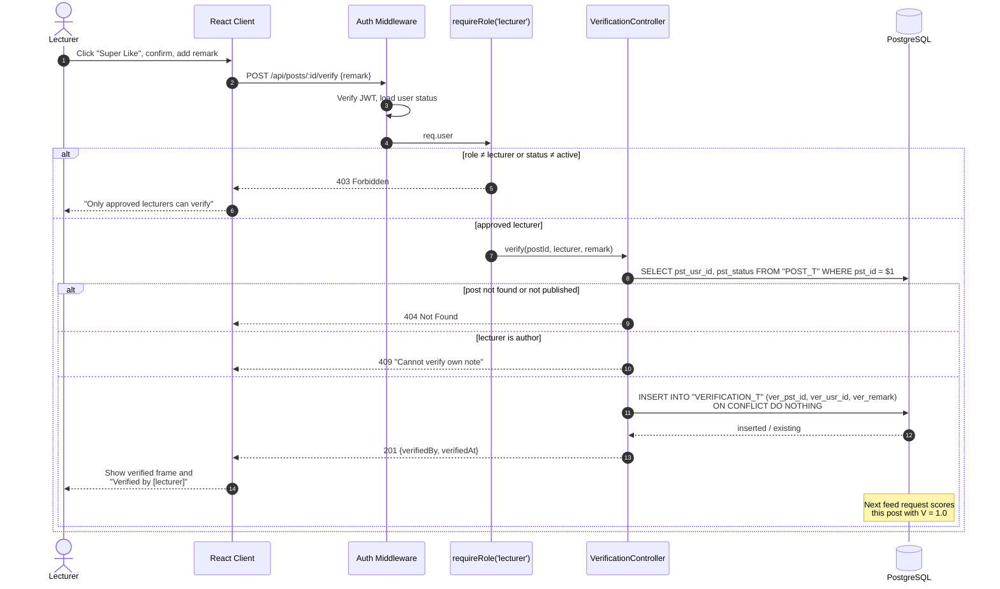

# Sequence diagram: lecturer verification

```mermaid
sequenceDiagram
  autonumber
  actor L as Lecturer
  participant C as React Client
  participant A as Auth Middleware
  participant R as requireRole('lecturer')
  participant VC as VerificationController
  participant DB@{ "type": "database" } as PostgreSQL

  L->>C: Click "Super Like", confirm, add remark
  C->>A: POST /api/posts/:id/verify {remark}
  A->>A: Verify JWT, load user status
  A->>R: req.user
  alt role ≠ lecturer or status ≠ active
    R-->>C: 403 Forbidden
    C-->>L: "Only approved lecturers can verify"
  else approved lecturer
    R->>VC: verify(postId, lecturer, remark)
    VC->>DB: SELECT pst_usr_id, pst_status FROM "POST_T" WHERE pst_id = $1
    alt post not found or not published
      VC-->>C: 404 Not Found
    else lecturer is author
      VC-->>C: 409 "Cannot verify own note"
    else
      VC->>DB: INSERT INTO "VERIFICATION_T" (ver_pst_id, ver_usr_id, ver_remark)<br/>ON CONFLICT DO NOTHING
      DB-->>VC: inserted / existing
      VC-->>C: 201 {verifiedBy, verifiedAt}
      C-->>L: Show verified frame and<br/>"Verified by [lecturer]"
      Note over DB: Next feed request scores<br/>this post with V = 1.0
    end
  end
```
