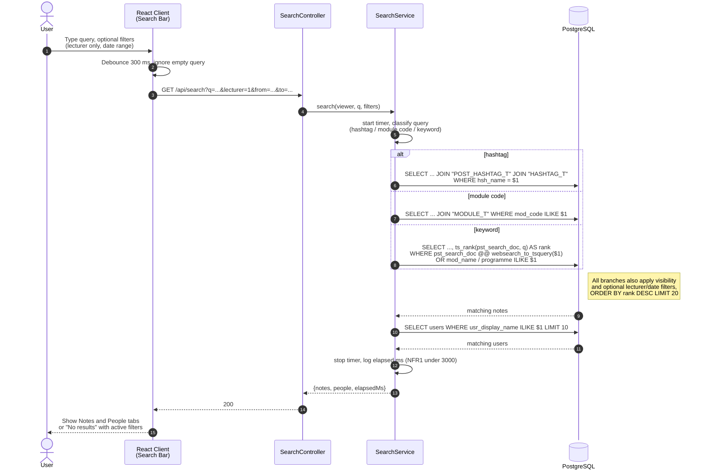

# Sequence diagram: search

```mermaid
sequenceDiagram
  autonumber
  actor U as User
  participant C as React Client<br/>(Search Bar)
  participant SC as SearchController
  participant SS as SearchService
  participant DB@{ "type": "database" } as PostgreSQL

  U->>C: Type query, optional filters<br/>(lecturer only, date range)
  C->>C: Debounce 300 ms, ignore empty query
  C->>SC: GET /api/search?q=...&lecturer=1&from=...&to=...
  SC->>SS: search(viewer, q, filters)
  SS->>SS: start timer, classify query<br/>(hashtag / module code / keyword)
  alt hashtag
    SS->>DB: SELECT ... JOIN "POST_HASHTAG_T" JOIN "HASHTAG_T"<br/>WHERE hsh_name = $1
  else module code
    SS->>DB: SELECT ... JOIN "MODULE_T" WHERE mod_code ILIKE $1
  else keyword
    SS->>DB: SELECT ..., ts_rank(pst_search_doc, q) AS rank<br/>WHERE pst_search_doc @@ websearch_to_tsquery($1)<br/>OR mod_name / programme ILIKE $1
  end
  Note right of DB: All branches also apply visibility<br/>and optional lecturer/date filters,<br/>ORDER BY rank DESC LIMIT 20
  DB-->>SS: matching notes
  SS->>DB: SELECT users WHERE usr_display_name ILIKE $1 LIMIT 10
  DB-->>SS: matching users
  SS->>SS: stop timer, log elapsed ms (NFR1 under 3000)
  SS-->>SC: {notes, people, elapsedMs}
  SC-->>C: 200
  C-->>U: Show Notes and People tabs<br/>or "No results" with active filters
```
