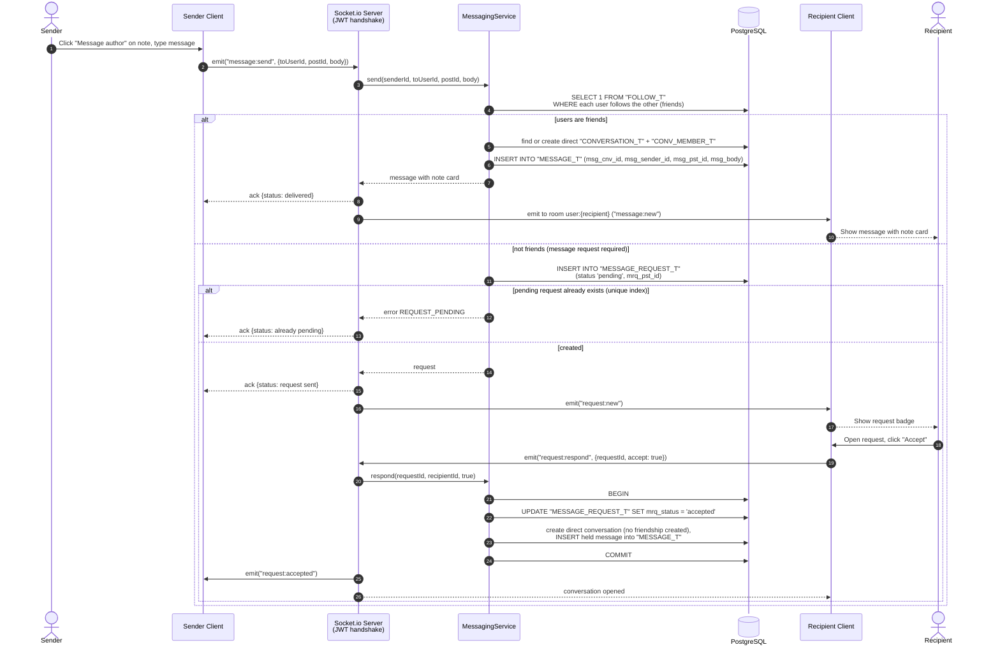

# Sequence diagram: post-anchored message

```mermaid
sequenceDiagram
  autonumber
  actor S as Sender
  participant SC as Sender Client
  participant IO as Socket.io Server<br/>(JWT handshake)
  participant MS as MessagingService
  participant DB@{ "type": "database" } as PostgreSQL
  participant RC as Recipient Client
  actor R as Recipient

  S->>SC: Click "Message author" on note, type message
  SC->>IO: emit("message:send", {toUserId, postId, body})
  IO->>MS: send(senderId, toUserId, postId, body)
  MS->>DB: SELECT 1 FROM "FOLLOW_T"<br/>WHERE each user follows the other (friends)
  alt users are friends
    MS->>DB: find or create direct "CONVERSATION_T" + "CONV_MEMBER_T"
    MS->>DB: INSERT INTO "MESSAGE_T" (msg_cnv_id, msg_sender_id, msg_pst_id, msg_body)
    MS-->>IO: message with note card
    IO-->>SC: ack {status: delivered}
    IO->>RC: emit to room user:{recipient} ("message:new")
    RC-->>R: Show message with note card
  else not friends (message request required)
    MS->>DB: INSERT INTO "MESSAGE_REQUEST_T"<br/>(status 'pending', mrq_pst_id)
    alt pending request already exists (unique index)
      MS-->>IO: error REQUEST_PENDING
      IO-->>SC: ack {status: already pending}
    else created
      MS-->>IO: request
      IO-->>SC: ack {status: request sent}
      IO->>RC: emit("request:new")
      RC-->>R: Show request badge
      R->>RC: Open request, click "Accept"
      RC->>IO: emit("request:respond", {requestId, accept: true})
      IO->>MS: respond(requestId, recipientId, true)
      MS->>DB: BEGIN
      MS->>DB: UPDATE "MESSAGE_REQUEST_T" SET mrq_status = 'accepted'
      MS->>DB: create direct conversation (no friendship created),<br/>INSERT held message into "MESSAGE_T"
      MS->>DB: COMMIT
      IO->>SC: emit("request:accepted")
      IO-->>RC: conversation opened
    end
  end
```
