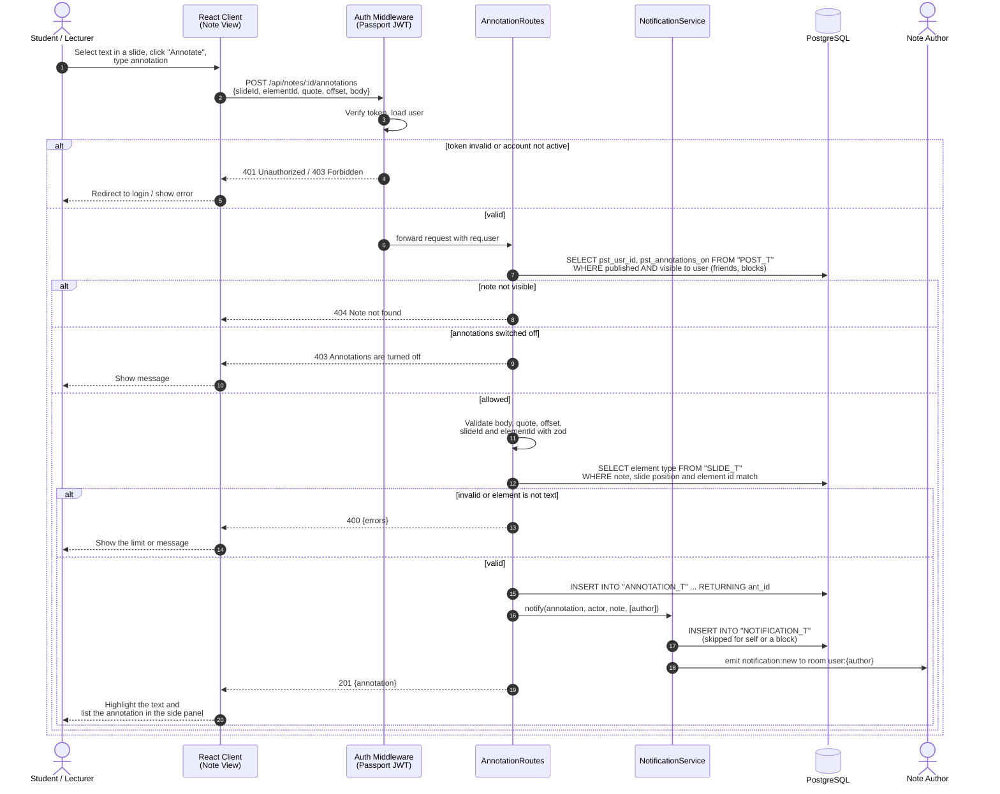

# Sequence diagram: annotate note

```mermaid
sequenceDiagram
  autonumber
  actor U as Student / Lecturer
  participant C as React Client<br/>(Note View)
  participant A as Auth Middleware<br/>(Passport JWT)
  participant AR as AnnotationRoutes
  participant NS as NotificationService
  participant DB@{ "type": "database" } as PostgreSQL
  actor N as Note Author

  U->>C: Select text in a slide, click "Annotate",<br/>type annotation
  C->>A: POST /api/notes/:id/annotations<br/>{slideId, elementId, quote, offset, body}
  A->>A: Verify token, load user
  alt token invalid or account not active
    A-->>C: 401 Unauthorized / 403 Forbidden
    C-->>U: Redirect to login / show error
  else valid
    A->>AR: forward request with req.user
    AR->>DB: SELECT pst_usr_id, pst_annotations_on FROM "POST_T"<br/>WHERE published AND visible to user (friends, blocks)
    alt note not visible
      AR-->>C: 404 Note not found
    else annotations switched off
      AR-->>C: 403 Annotations are turned off
      C-->>U: Show message
    else allowed
      AR->>AR: Validate body, quote, offset,<br/>slideId and elementId with zod
      AR->>DB: SELECT element type FROM "SLIDE_T"<br/>WHERE note, slide position and element id match
      alt invalid or element is not text
        AR-->>C: 400 {errors}
        C-->>U: Show the limit or message
      else valid
        AR->>DB: INSERT INTO "ANNOTATION_T" ... RETURNING ant_id
        AR->>NS: notify(annotation, actor, note, [author])
        NS->>DB: INSERT INTO "NOTIFICATION_T"<br/>(skipped for self or a block)
        NS->>N: emit notification:new to room user:{author}
        AR-->>C: 201 {annotation}
        C-->>U: Highlight the text and<br/>list the annotation in the side panel
      end
    end
  end
```
